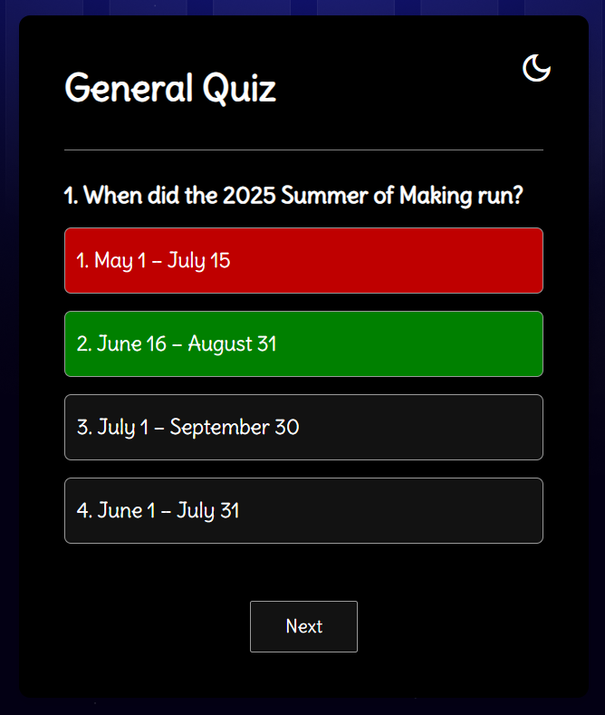

# Quiz App 

This is a simple yet interactive **JavaScript quiz app**. It features 10 multiple-choice questions, instant feedback, score tracking, and a clean UI with optional dark mode.

---

## 📸 Demo
> 
---

## 🧠 Features

* ✅ 10 curated multiple-choice questions
* ✅ Instant feedback (correct/incorrect highlights)
* ✅ Score tracking
* ✅ “Play Again” restart option
* 🌗 Optional Dark Mode toggle
* 🧼 Simple vanilla JavaScript (no frameworks)

---


## 🛠️ Technologies Used

* HTML5
* CSS3
* JavaScript (ES6)

---

## 🧪 How It Works

1. The quiz starts automatically on page load.
2. Each question shows 4 options.
3. Clicking an answer gives immediate visual feedback:

   * ✅ Correct answers turn green.
   * ❌ Incorrect answers turn red.
4. After answering, click “Next” to continue.
5. At the end, a score summary appears, and you can restart the quiz.

---

## 🌚 Bonus: Dark Mode

Click the **"Toggle Dark Mode"** button to switch themes anytime.
Just make sure you have this button in your HTML:

```html
<button id="toggleDarkMode">Toggle Dark Mode</button>
```

---

## 🚀 Getting Started

To run locally:

```bash
git clone https://github.com/grace-wdev/quiz-app.git
cd quiz-app
open index.html   # or use Live Server
```

Or deploy online via [Vercel](https://vercel.com/) or GitHub Pages.

---

## 🧠 Customize the Quiz

To change questions, go to `script.js` and edit the `questions` array:

```js
const questions = [
  {
    question: "When did the 2025 Summer of Making run?",
    options: [
      { text: "May 1 – July 15", correct: false },
      { text: "June 16 – August 31", correct: true },
      ...
    ]
  },
  ...
];
```

---

## 📄 License

This project is open-source and available under the [MIT License](LICENSE).

---

## 🙌 Contribute

Got an idea? Found a bug?
Pull requests and suggestions are welcome!
